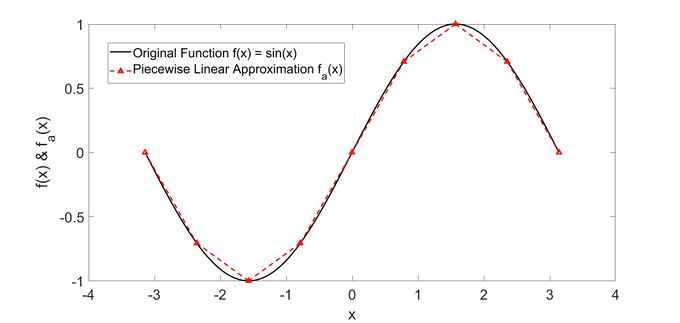
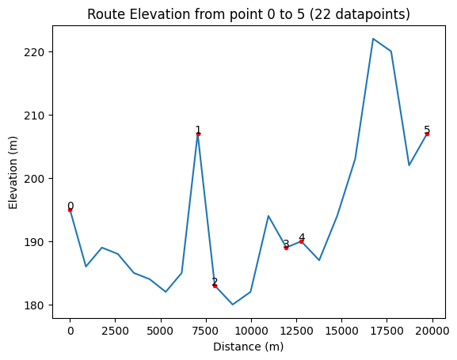

# RouteElevation & CoordinateElevation

**Use RouteElevation when you have a route and you would like to let the algorithm automatically sample elevations in between coordinates. Use CoordinateElevation when you only want the elevations for your (exact) coordinate inputs.** 

**This is because RouteElevation does _n_ API calls where _n_=number of coordinates (because it needs to automatically sample elevations in between coordinates). CoordinateElevation does not automatically sample elevations in between coordinates so it only uses 1 API call. Don't use RouteElevation for CoordinateElevation purposes.**

- [RouteElevation](#routeelevation)
- [CoordinateElevation](#coordinateelevation)
---
---
# RouteElevation - This class is deprecated. Please use RouteModel paired with CoordinateElevations instead
## Introduction
RouteElevation is a class that calulates and graphs the elevation data of a route that is represented by a [polygonal chain](https://en.wikipedia.org/wiki/Polygonal_chain) (where each vertex on the polygonal chain represents a real-life coordinate).

For example, if our route was the sine function (shown below), the polygonal chain would basically be the red piecewise linear approximatation. The verteces of the chain will represent coordinate points and will need to be in sequential order of the route.

It is best to add a new vertex whenever the polygonal chain starts to deviate 10-15 degrees from the route (but note that the more vertices you add, the longer the algorithm will need to take). Short curves can be exempted from this rule (see vertices that are at the peaks/troughs of the sine curve)



---
## User Guide
When using this, there are only 4 things that you need to know:

- The object initialization
- The `get_dataframe()` method
- The `plot_elevations()` method

### The object initialization
Initializing the object requires 2 required parameters: `coordinates` and `BING_MAPS_API_KEY`, and 3 optional parameters: `sample_frequency_upper_bound`, `offset`, and `debug`.

- `coordinates` (required): This is the polygonal chian that represents the route. It is of the form `[(Lat1,Long1), (Lat2,Long2)...(LatN,LongN)]` and requires at least 2 coordinates.
- `BING_MAPS_API_KEY` (required): This string is your API key for Bing Maps
- `sample_frequency_upper_bound` (optional, `default=1000`): When getting elevations, we not only get the eleavtions at 2 adjacent coordinates (vertices), but we also get the elevation at equally-distanced intervals between the 2 adjacent coordinates. The `sample_frequency_upper_bound` is an `Int` that represents the upper bound (in meters) for the interval distance for the "in-between" sample points that are used. 
- `offset` (optional, `default=0`): This is used to offset the starting distance of the route (in meters). For example, let's say the route starts 3km into the race. If you want the route to start counting from 3km rather than 0km, you would set the `offset` value to 3000
- `debug` (optional, `default=False`): Set this value to `True` if you want the object to print data upon each step of the algorithm (for debugging purposes). Otherwise, set to `False`

> Note: there is a maximum of 1023 intervals that we can use between 2 coordinates, so the `sample_frequency_upper_bound` may be overwritten if the distance between the adjacent coordinates exceeds `sample_frequency_upper_bound*1023`. To fix this issue, divide the "line segment" into multiple smaller segments

Do not change any class variables after initializing the object. Doing so may break the flow of the algorithm, resulting in an error. Create a new object instead.

### The `get_dataframe()` method
Returns a Pandas DataFrame of the `latitude`,  `longitude`,  `elevation`

### The `plot_elevations()` method
This method is similar to the `get_dataframe()` method, but plots a graph rather than returning data.


---
## Tutorial

> Make sure you have your API key for Bing Maps and place it in the class

Let's say I want to measure the route from McDonalds (bottom left) to Penville (top left). The black route (shown below) would be the polygonal chain representation of our route that we wish to get elevations for.


### First, we will need get all 6 coordinates:
```
coordinates = [(44.0104111274582, -79.67866520101909), (44.028996763626, -79.59455210533561), (44.037352902093524, -79.596693165953), (44.067688969642624, -79.62238589336177), (44.07494094439971, -79.62452695397917), (44.05647962446555, -79.70741658645272)]
```

### Next, we create a RouteElevation object using our coordinates:
```
route = RouteElevation(coordinates=coordinates, BING_MAPS_API_KEY=BING_MAPS_API_KEY, sample_frequency_upper_bound=1000, offset=0, debug=False)
```

### We can get the elvations of our route as a Pandas Dataframe:
```
data = route.get_dataframe() # All distances and elevations
print(data)
```
```
OUTPUT

    distance  elevation
0          0        195
1        881        186
2       1763        189
3       2644        188
4       3526        185
5       4408        184
6       5289        182
7       6171        185
8       7053        207
9       7997        183
10      8984        180
11      9972        182
12     10959        194
13     11947        189
14     12771        190
15     13764        187
16     14756        194
17     15749        203
18     16742        222
19     17735        220
20     18728        202
21     19721        207
```

### Lastly, we can plot the elvations of our route:
```
route.plot_elevations() # Plots all distances and elevations
```
```
OUTPUT
```

---
---

# CoordinateElevation
## Introduction
CoordinateElevation is a class that calulates and graphs the elevation data for a list of coordinates

## User Guide
When using this, there are only 4 things that you need to know:

- The object initialization
- The `get_dataframe()` method
- The `plot_elevations()` method

### The object initialization
Initializing the object requires 2 required parameters: `coordinates` and `BING_MAPS_API_KEY`, and 1 optional parameter: `debug`.

- `coordinates` (required): These are the coordinates that you would like to get elevations for. It is of the form `[(Lat1,Long1), (Lat2,Long2)...(LatN,LongN)]` and requires at least 2 coordinates.
- `BING_MAPS_API_KEY` (required): This string is your API key for Bing Maps
- `debug` (optional, `default=False`): Set this value to `True` if you want the object to print data upon each step of the algorithm (for debugging purposes). Otherwise, set to `False`

Do not change any class variables after initializing the object. Doing so may break the flow of the algorithm, resulting in an error. Create a new object instead.

### The `get_dataframe()` method
Returns a Pandas DataFrame of the `latitude`,  `longitude`,  `elevation`, and `relative_elevation_gains_to_next`

### The `plot_elevations()` method
This method is similar to the `get_dataframe()` method, but plots a graph rather than returning data.


---
## Tutorial

The usage of this class is the exact same as [RouteElevation](#routeelevation) so please see that tutorial instead. Only the type of input/output data is different. The user interface/methods are the exact same
